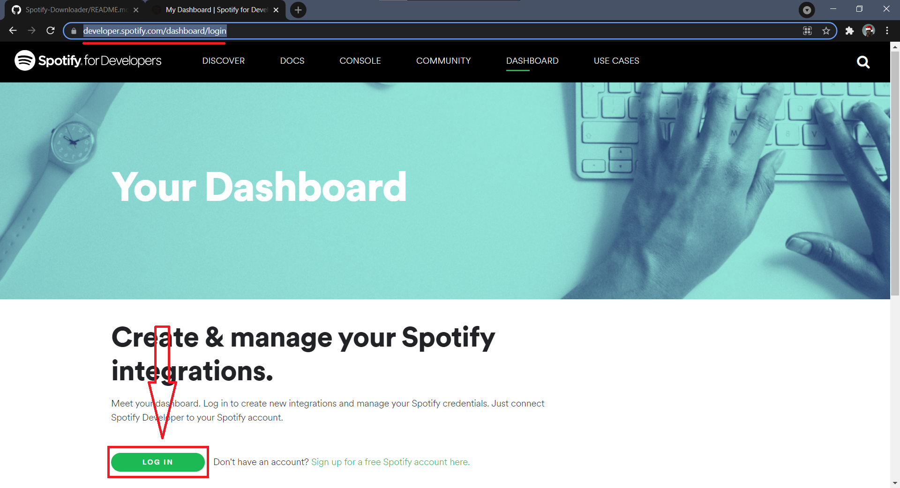
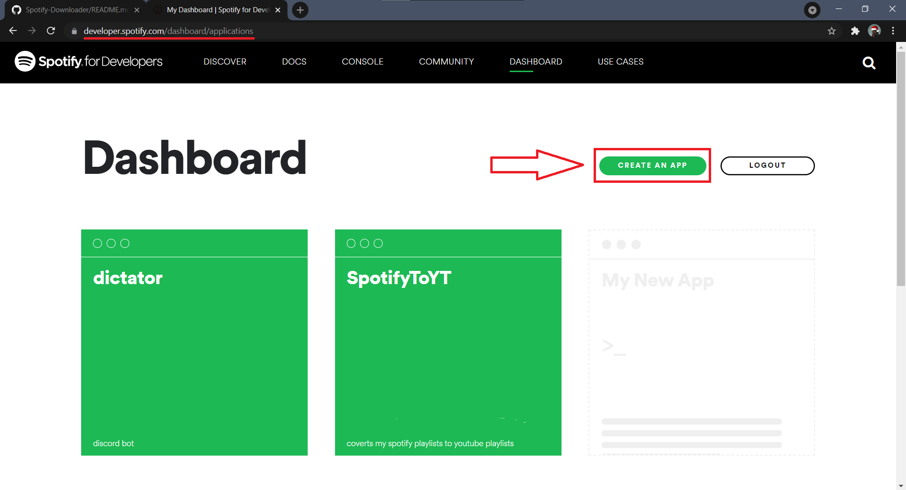
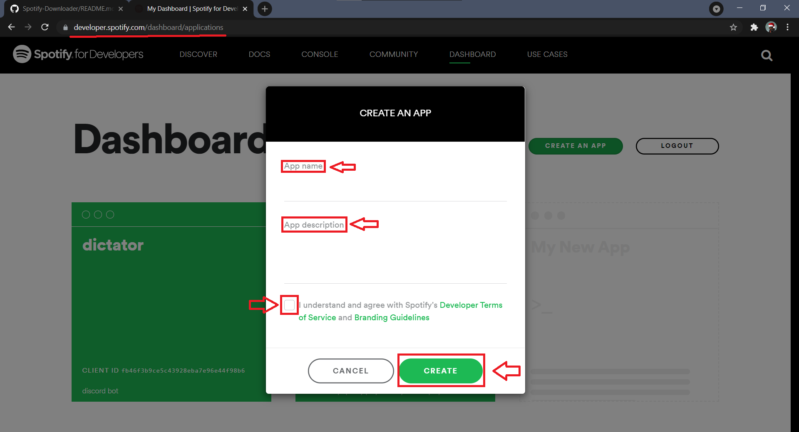
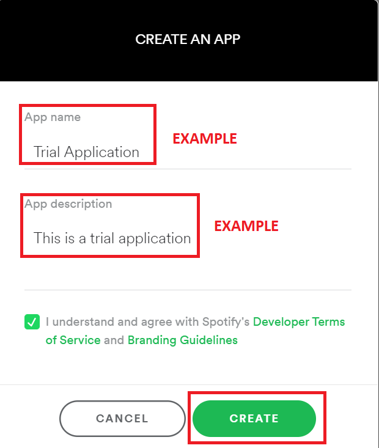
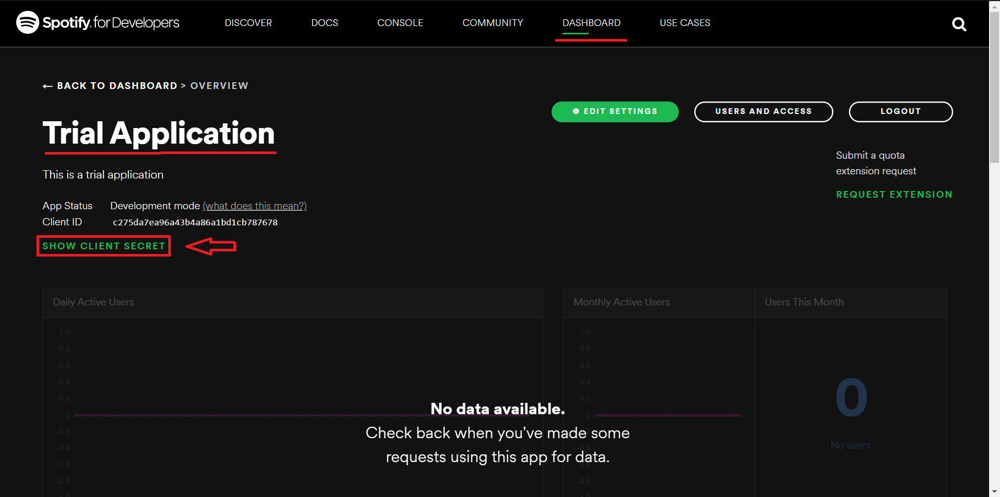
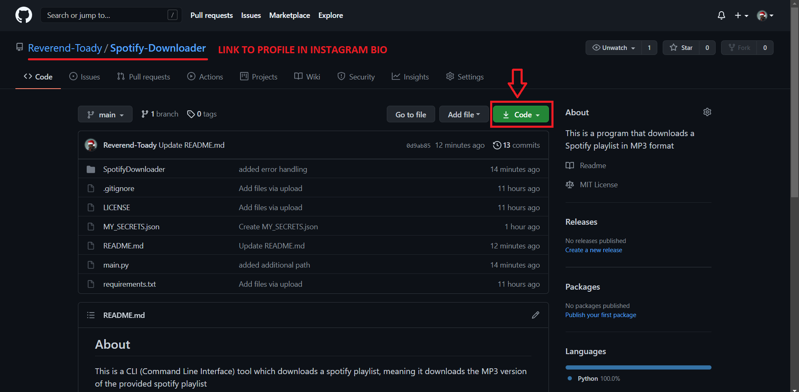
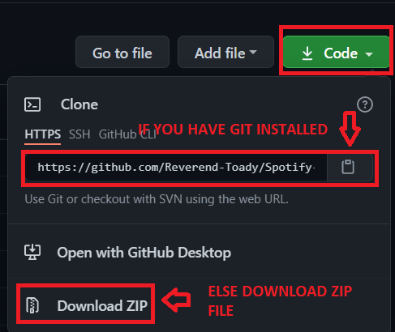
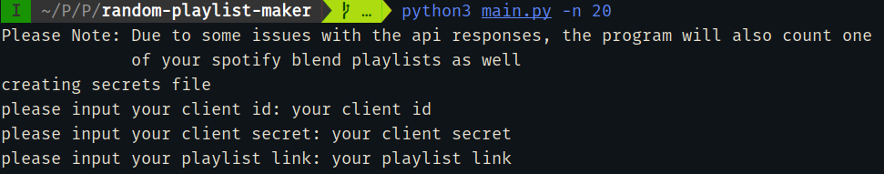
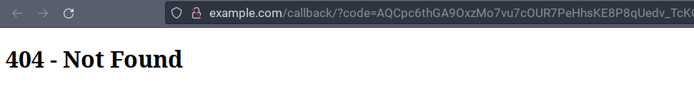

## Installation Guide

1.  Go to [Spotify Developers](https://developer.spotify.com/dashboard/login)
    and LogIn from your Spotify Account

2. After Logging In from your Spotify Account create a new Application

3. Click on `Create An App` and you will see this page

- An Example Image Has Been Provided

4. After clicking on `Create` you will be redirected to this page

5. Click on `SHOW CLIENT SECRET` highlighted in green text

6. Copy `Client ID` and `Client Secret` separately since they are needed later
   on

7. Then go to the
   [GitHub Repository](https://github.com/Reverend-Toady/Spotify-Downloader)
   Main Page and click on `Code` highlighted in green

8. After clicking on `Code` you will see something like this

9. If you have [Git](https://git-scm.com/downloads) installed you can clone the
   repository
   `$git clone https://github.com/Reverend-Toady/Spotify-Downloader.git`

10. If you don't, no need to worry click on `Download ZIP` to download the zip
    file

11. Then go to where you cloned or downloaded the repository contents and open a
    terminal

12. now just run

    - If on **linux**
      `python3 main.py -n/--number [OPTIONAL PARAMETER (number of songs to add in playlist)]`
    - If on **windows**
      `python main.py -n/--number [OPTIONAL PARAMETER (number of songs to add in playlist)]`

    - **for example** `python3 main.py -n 20` (adds 20 songs to the playlist)

13. You will now be greeted by something like

    - in the client id section add in the client id that was talked about earlier
    - in the client secret section add in the client secret that was talked about earlier
    - in the playlist link section add in the link to the playlist that you want to add random songs to

**Note: if you get invalid client id or secret or any other error related to
this, please delete the secrets.json file and try again**

**Note: Please add in the link to an empty playlist since the program deletes
all songs in the playlist before adding new ones**

[how to create a spotify playlist](https://www.pcmag.com/how-to/how-to-create-a-spotify-playlist)

14. Now you will be redirected to a page asking for you to authorize the program
    accessing your spotify account information, please click agree

15. now copy the url to the page you are in

16. Paste this redirect url to the promt asking for it in the terminal

17. The program should run well now, if facing any errors please open an issue
    on github
